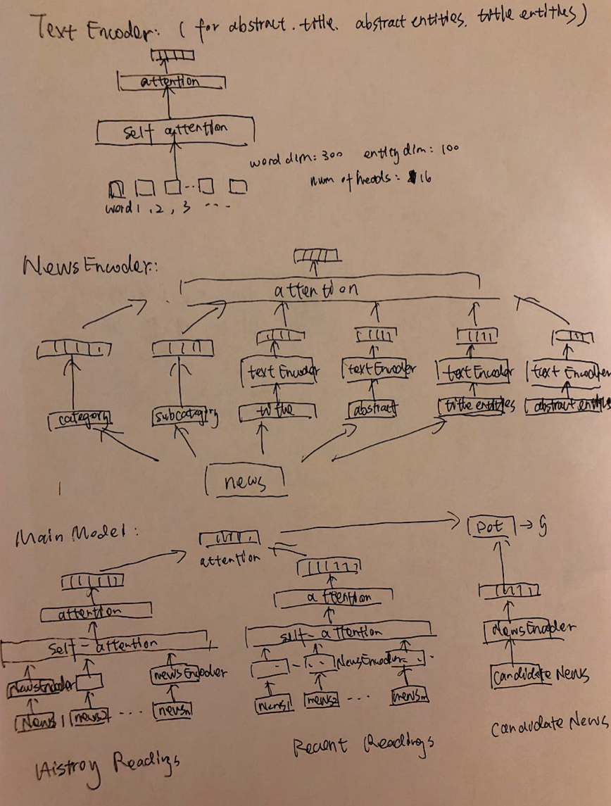

# NRMS_new for MIND News Recommendation 

The source codes of the NRMS_new model for the [MIcrosoft News Dataset(MIND)](https://msnews.github.io/) inspired by these papers:

* **NRMS**--"Neural News Recommendation with Multi-Head Self-Attention" Chuhan Wu, Fangzhao Wu, Suyu Ge, Tao Qi, Yongfeng Huang,and Xing Xie (EMNLP 2019). 
* **MIND**--"MIND: A Large-scale Dataset for News Recommendation" Fangzhao Wu, Ying Qiao, Jiun-Hung Chen, Chuhan Wu, Tao Qi, Jianxun Lian, Danyang Liu, Xing Xie, Jianfeng Gao, Winnie Wu, Ming Zhou (ACL 2020)
* **LSTUR**--"Neural News Recommendation with Long- and Short-term User Representations" Mingxiao An, Fangzhao Wu, Chuhan Wu, Kun Zhang, Zheng Liu, Xing Xie (ACL 2019)
* **NAML**--"Neural News Recommendation with Attentive Multi-View Learning" Chuhan Wu, Fangzhao Wu, Mingxiao An, Jianqiang Huang, Yongfeng Huang, Xing Xie (IJCAI 2019)

### Brief model descriptions:

The whole model consists of three modules: **TextEncoder**, **NewsEncoder**, and **NRMS_new**, which is a **hierarchical self-attention and additive attention structure** to embed users' reading histories, each news in their reading histories, and each part of news at the same time. 

1. **TextEncoder:** same as the NewsEncoder in NRMS, a combindation of multi-head self-attention and additive attention mechanism to generate embeddings for a text, which can be title text, abstract text, title entities, and abstract entities. It also serves as a natural framework to encode the reading history news sequences of users on top of the embeded news to a single vector.
2. **NewsEncoder:** an additive attention that combines category embeddings, subcategory embeddings, title text embeddings, abstract text embeddings, title entity embeddings, and abstract entity embeddings and adds them up to a single vector for a piece of news.
3. **NRMS_new:** an additive attention that combines the embeddings of a user's reading histories and recent browsed news to a single vector and then performs dot product with the candidate news embeddings. Negative sampling is used in  model training. For each news browsed by a user (regarded as a positive sample), randomly sample K news which are shown in the same impression but not clicked by the user (regarded as negative samples). Re-formulate the news click probability prediction problem as a pseudo (K + 1)-way classification task, and the lossfunction for model training is the negative log-likelihood of all positive samples.

### Steps to run the codes:

1. **Set up three folders in the same directory:**   
	* 'MINDlarge\_train' for training data
	* 'MINDlarge\_dev' for validation data
	* 'glove' for the [pretrained GloVe embeddings](http://nlp.stanford.edu/data/glove.840B.300d.zip)
2. **Data preprocess:**
	* _python data\_preprocess/behavior\_preprocess.py_
	* _python data\_preprocess/news\_preprocess.py_
	* *python glove/generate\_glove\_dict.py*
	 * 	(this three commands can be ran in parallel)
3. **Model training:**
	1. 	Set up directories for data files and hyperparameters in src/utils.py.
	2. Model training: _python src/main.py_
3. **Generate ranking list of news for test set:**
	* 	upcoming... 

contact: Weijie Jiang, jiangwj@berkeley.edu	

